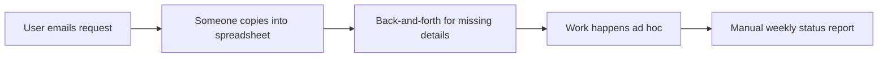
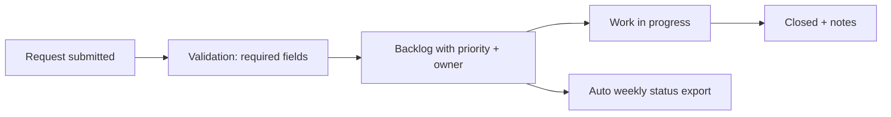

# As-Is / To-Be Workflow

## As-Is (spreadsheet)

```mermaid
flowchart LR
  A[User emails request] --> B[Someone copies into spreadsheet]
  B --> C[Back-and-forth for missing details]
  C --> D[Work happens ad hoc]
  D --> E[Manual weekly status report]
```

## To-Be (structured tracker)

```mermaid
flowchart LR
  A[Request submitted] --> B[Validation: required fields]
  B --> C[Backlog with priority + owner]
  C --> D[Work in progress]
  D --> E[Closed + notes]
  C --> F[Auto weekly status export]
```

